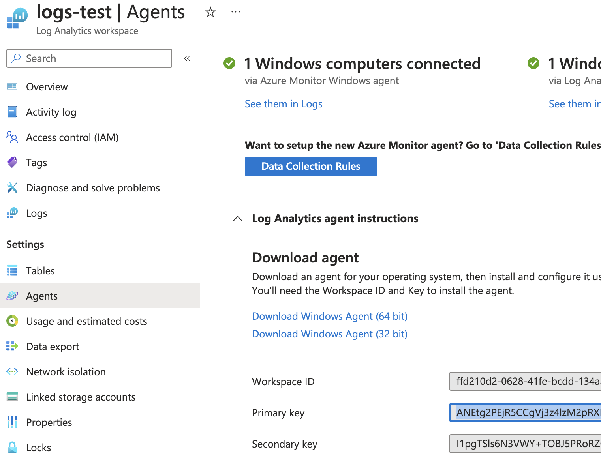
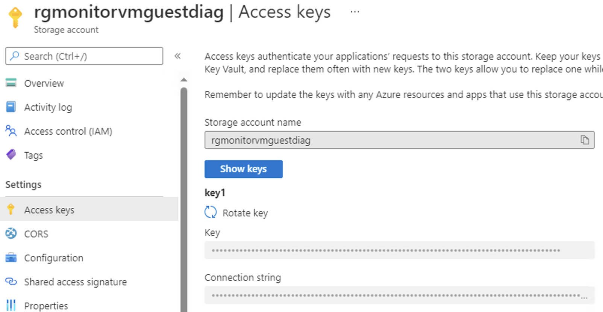
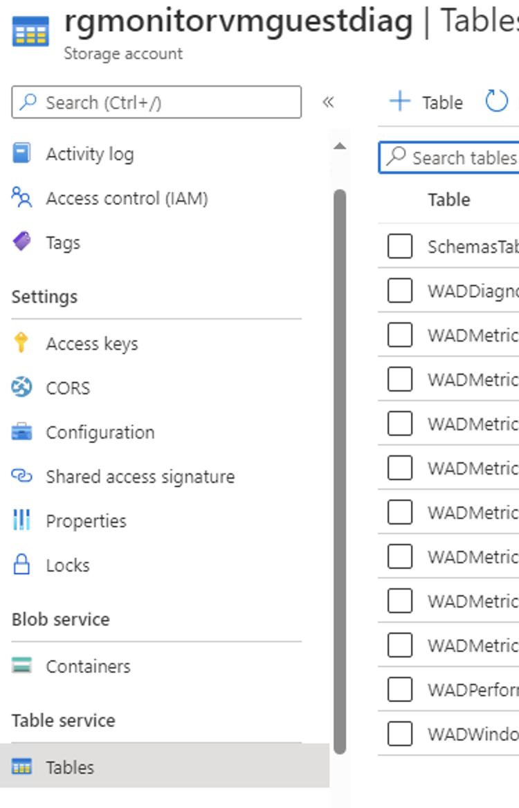

# Azure Storage Log Collector
This repository contains a PowerShell script which loads log data from an Azure Storage Account and sends it into a Log Analytics Workspace.

### Target Platform: Azure Stack Hub

## Use case description
Resources in Azure Stack Hub store diagnostic settings logs inside Storage Account Tables. In order to work with this table data within Azure Log Analytics workspace, we need to send them using RestAPI into the public cloud.

The script loads defined tables' rows stores the latest timestamp in a local text file and sends the loaded rows into the specified log analytics workspace.

## Server Prerequisites
- Windows Server with network access to Azure Stack Hub target storage account.
- PowerShell 5.1 with **Az**, **AzTable** and **AzureStack** modules.

**Tip!** to properly setup PowerShell to work with Azure Stack Hub follow this tutorial: https://learn.microsoft.com/en-us/azure-stack/operator/powershell-install-az-module?view=azs-2311.

## Running the script
### Prerequisites
In order to start collecting the data we first need to setup our config file.
We will need to get:
- Log Analytics Workspace ID (Azure)
- Log Analytics Workspace Key (Azure)
- Connection Storage (Azure Stack Hub)
  
**Log Analytics Workspace ID and Key**
Navigate to your Workspace in Azure and select 'Agents' section under 'Settings' in the left menu. Within the Agents settings expand 'Log Analytics agent instructions' and reveal the ID and Key.



**Storage Account Connection String**
Navigate to the storage Account in Azure Stack Hub you would like to start collecting the Log tables from and select section 'Access keys' in the left menu 'Settings'. Show the keys and select Connection string.



**Storage Account Table Names**
Collect table names from the storage account you would like to forward to the Log Analytics Workspace. The talbes are found in the 'Table service' section in the storage account.

**Note!** The table names vary based on the type of service which is sending its logs.



### Prepare the config file
The script reads input data from a config file. This config file has a predifined structure and must be present and filled in order to collect the log table data.

The config file must be present in the same folder as the collector.ps1 script.

**Note!** If you run the script without the config file present, an empty config file will be created for you to fill in.

Fill in the config file with the data received from the previous steps.

**COLLECTED_TABLES must be delimmited with a comma.**

**Example of a filled in config file**
```
WORKSPACE_ID:ffd210d2-0628-41fe-bcdd-1348888e14f
WORKSPACE_KEY:ANEtg2PEjR5CCgVj3z4lzM2pRXPh8W8888gJwSqpw3Czv5U5t221MZJZtHRSpui4qyaV0elS398oZzmdHcwvhQ==
CONNECTION_STRING:DefaultEndpointsProtocol=https;AccountName=satestacc;AccountKey=cmzbs/Z2jjlidncaa5EYRNi0oXyXhN+f52iJ/0/TlYSz4Jn+n/AbIGaxv/vK43apUV7Yj+ASt/OUrwA==;EndpointSuffix=core.windows.net
COLLECTED_TABLES:WADWindowsEventLogsTable,WADDiagnosticInfrastructureLogsTable,WADPerformanceCountersTable
```
### Run the script
After you have prepared the config file. You are ready to run the script. Moved the script and the config file to a dedicated server. Using the command line or PowerShell ISE run the collector.ps1 script.

The script will use current date and time and collect all data since this instance. After sending the data into Log Analytics, it will save the last data timestamp into a local database file and will use this timestamp as default during the next time.

### Run on schedule
In order to collect the data periodically use Task Manager in Windows to schedule a periodic script run.
Recommened interval is 5 minutes.

Set action in Task Scheduler to **Start a program** and set the value to: C:\Windows\System32\WindowsPowerShell\v1.0\powershell.exe Add Argument value with complete path to the collector.ps1 script like: "C:\Collector\collector.ps1" (example)